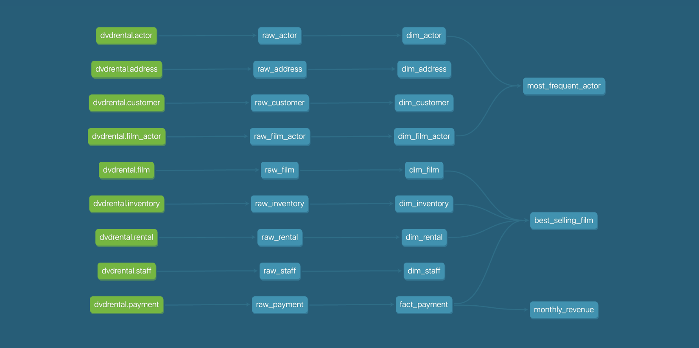

# dbt Hands-on: Building Data Warehouse

This project demonstrates a hands-on approach to working with dbt (Data Build Tool) using the PostgreSQL `dvdrental` sample database. The setup includes creating a data warehouse and modeling data using dbt with a medallion architecture approach.

## Setup Instructions

### 1. Start Postgres Database
- **Docker Users:** Ensure Docker is installed and running.
- **Non-Docker Users:** Ensure PostgreSQL is installed on your device.

### 2. Load Sample Data
1. Download the sample data: [dvdrental.zip](https://www.postgresqltutorial.com/wp-content/uploads/2019/05/dvdrental.zip)
2. Extract the ZIP file into a directory (e.g., `./dvdrental`).

## Using Postgres with Docker

1. **Start the Postgres Container**  
   Run the following command to create and start a Docker container with PostgreSQL and mount the sample data:
   ```bash
   docker run --name postgres-test \
     -e PGDATA=/var/lib/postgresql/data \
     -e POSTGRES_PASSWORD=postgres \
     -e POSTGRES_USER=postgres \
     -e POSTGRES_DB=postgres \
     -p 5433:5432 \
     -v ./dvdrental:/dvdrental \
     -v dbt-postgres:/var/lib/postgresql/data \
     -d postgres:12

2. **Restore the Sample Database**
    Run the following command to Restore the Sample Database:
    ```bash
    docker exec -it <postgres-container-name> bash
    create database data_warehouse;
    \q
    pg_restore -U postgres -d data_warehouse /dvdrental
    ```

## Using Postgres without Docker
1. **Restore the Sample Database**
    ```sql
    psql -U postgres
    create database data_warehouse;
    \q
    pg_restore -U postgres -d data_warehouse /path/to/dvdrental
    ```

## DBT Setup
1. **Create a Virtual Environment**
    ```bash
    python3 -m venv env
    source env/bin/activate
    ```

2. **Install dbt Libraries**
    ```bash
    pip install dbt-core dbt-postgres
    ```

3. **Initialize DBT Project**
    ```bash
    dbt init
    ```

4. **Create `profiles.yml`**
    Configure the connection:
    ```yaml
    dbt_data_warehouse:
    outputs:
        dev:
        dbname: dbt_data_warehouse
        host: localhost
        pass: <your_password>
        port: 5433
        schema: dbt_dev
        threads: 1
        type: postgres
        user: postgres
        prod:
        dbname: dbt_data_warehouse
        host: localhost
        pass: <your_password>
        port: 5433
        schema: dbt
        threads: 1
        type: postgres
        user: postgres
    target: dev

    ```

5. **Test Connection**
    ```bash
    dbt debug
    ```

## Data Modeling

### Medallion Architecture Overview
    Medallion architecture is a data modeling pattern that organizes data into distinct layers:
    - Raw Layer: Ingests and stores raw data as-is from the source.
    - Intermediate Layer: Processes and transforms raw data into fact and dimension tables for analytics.
    - Mart Layer: Contains optimized datasets tailored for business intelligence and reporting.
    This architecture ensures data reliability, traceability, and scalability.

### Create Medallion Architecture Schemas
    Log in to the `dbt_data_warehouse` database:
    ```bash
    \c data_warehouse
    create schema dbt_dev_raw;
    create schema dbt_dev_intermediate;
    create schema dbt_dev_mart;
    ```

### Raw Models
    Define raw models for the following tables:
    - `payment`, `rental`, `staff`, `customer`, `address`, `inventory`, `film`, `film_actor`, `actor`
    
    Define them in sources.yml:
    ```yaml
    version: 2
    sources:
    - name: public
        database: data_warehouse
        schema: public
        tables:
        - name: payment
    ...
    ...
    ```

### Intermediate Models
    Transform raw data into fact and dimension tables:
    - Fact: `fact_payment`
    - Dimensions: `dim_rental`, `dim_staff`, `dim_customer`, `dim_address`, `dim_inventory`, `dim_film`, `dim_film_actor`, `dim_actor`

### Mart Models / Gold Layer
    Create mart models for business questions:
    - Monthly total revenue
    - Best-selling film
    - Actor with the most film roles

## dbt Documentation

1. **Generate Docs**
    ```bash
    dbt docs generate
    ```
2. **Run the dbt UI**
    ```
    dbt docs serve
    ```

## Results

### Data Lineage
    Below is the data lineage generated from the dbt project, showcasing the transformation flow from raw data to the final mart layer:
    

## Project Goals
- Implement medallion architecture with raw, intermediate, and mart layers.
- Build insights into revenue, top-selling films, and top-performing actors.
- Utilize dbt for end-to-end data modeling and documentation.

## Resources
    - PostgreSQL Sample Data: [DVDRental](https://www.postgresqltutorial.com/wp-content/uploads/2019/05/dvdrental.zip)
    - dbt Documentation: [dbt docs](https://docs.getdbt.com/docs/build/documentation)
